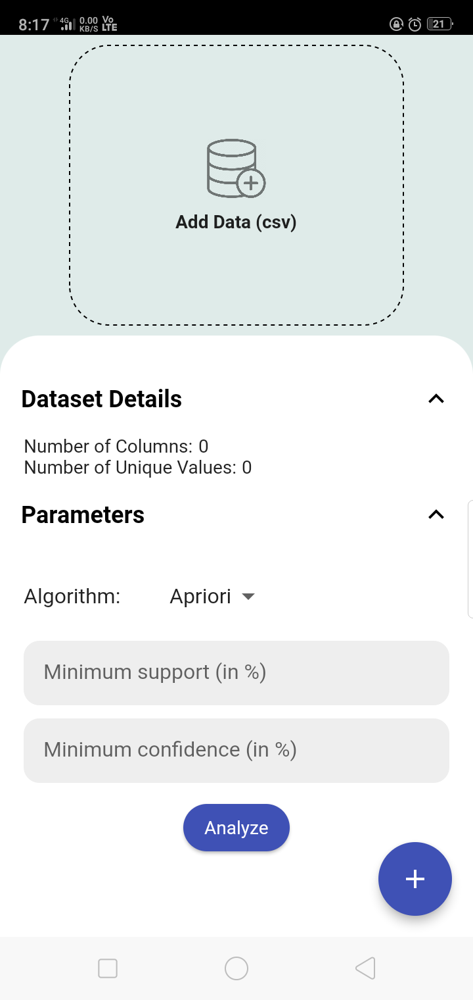
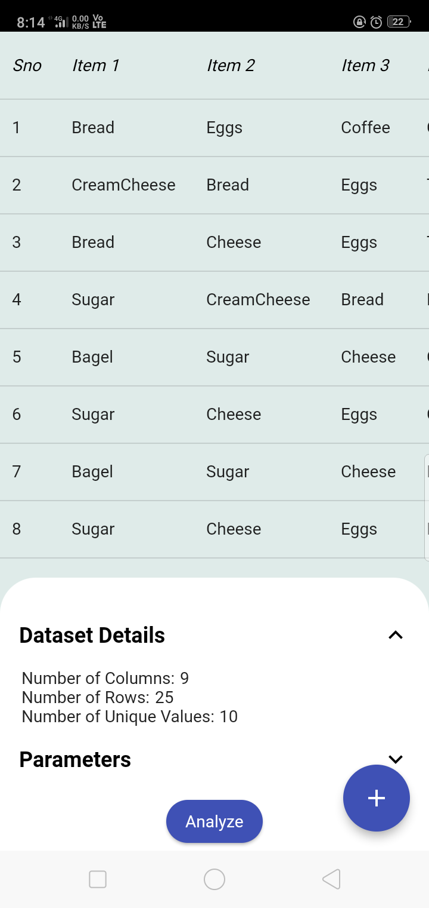
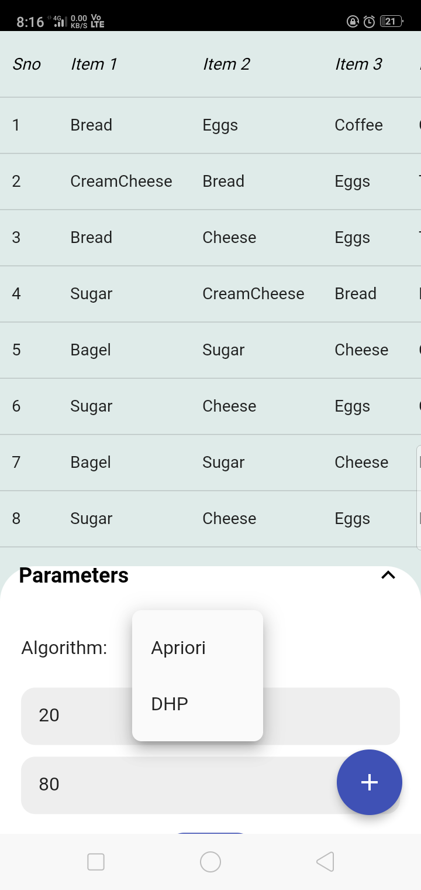
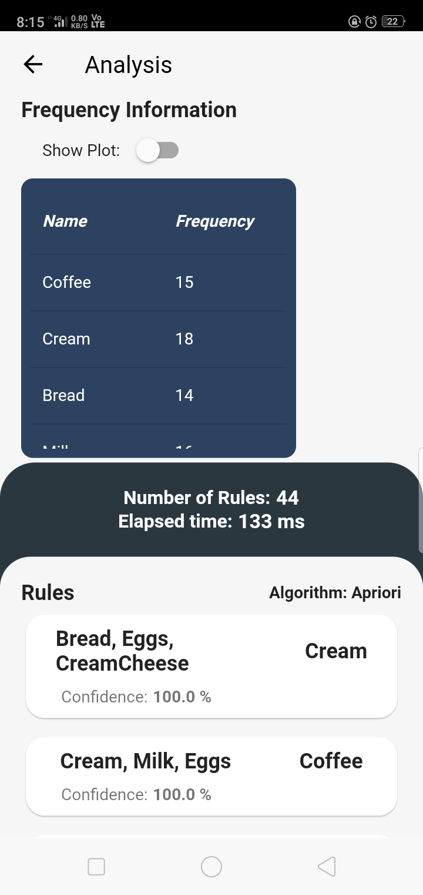
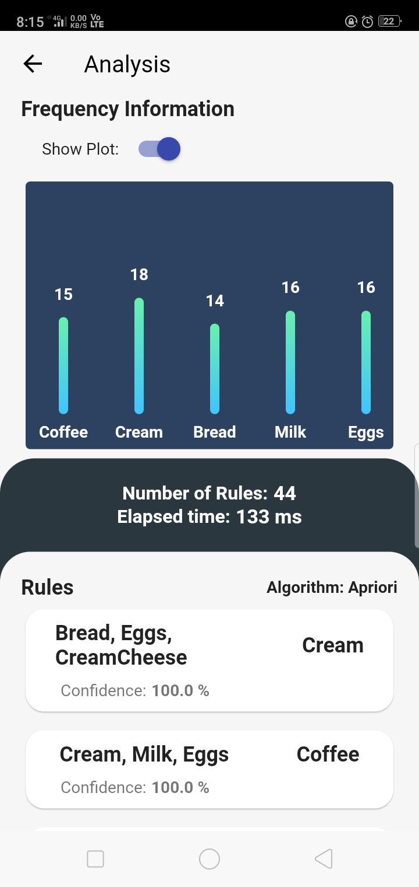
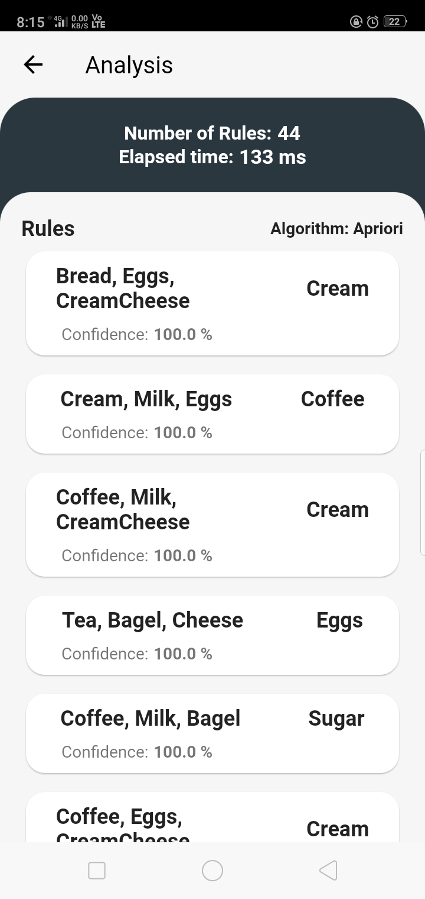

# Apriori App  
  
### Purpose  
  
To allow users an easy way to use apriori algorithm. 
  
### Features  
  
- Extract rules from transactional data in csv.
- Select variant of Apriori algorithm to use.
- Get Frequency of unique items in the data.
- Sort frequency on basis of count.

### App Screen Shots

#### Home Screen
 &nbsp;    

#### Analysis Screen

 &nbsp;  

